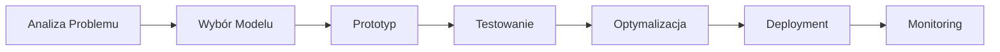

# Aplikacje AI

Zaawansowane aplikacje wykorzystujące sztuczną inteligencję, Large Language Models (LLM) i nowoczesne techniki AI do rozwiązywania praktycznych problemów.

## Przegląd Projektów

-   :material-video-box:{ .lg .middle } __Podsumowanie Audio/Video__

    ---

    Automatyczne generowanie podsumowań z treści audio i wideo przy użyciu AI.

    [:octicons-arrow-right-24: Zobacz projekt](podsumowanie-audio-video.md)

-   :material-gift:{ .lg .middle } __Pomocnik Prezentowy AI__

    ---

    Inteligentny asystent pomagający w doborze idealnych prezentów.

    [:octicons-arrow-right-24: Zobacz projekt](pomocnik-prezentowy.md)

-   :material-image-search:{ .lg .middle } __Znajdywacz Zdjęć__

    ---

    Zaawansowane wyszukiwanie obrazów z wykorzystaniem AI i rozpoznawania obiektów.

    [:octicons-arrow-right-24: Zobacz projekt](znajdywacz-zdjec.md)

## Technologie

W projektach AI wykorzystuję:

- **LLM (Large Language Models)** - GPT, Claude, inne modele językowe
- **Transformers** - Hugging Face, custom models
- **LangChain** - orchestracja aplikacji AI
- **RAG** (Retrieval-Augmented Generation)
- **Vector Databases** - przechowywanie embeddings
- **Streamlit** - interaktywne interfejsy użytkownika
- **FastAPI** - backend API

## Rodzaje Aplikacji

!!! tip "Przetwarzanie Języka Naturalnego (NLP)"
    Aplikacje wykorzystujące modele językowe do analizy tekstu, podsumowań, generowania treści i chatbotów.

!!! tip "Computer Vision"
    Rozwiązania z zakresu rozpoznawania obrazów, detekcji obiektów i analizy treści wizualnych.

!!! tip "Multimodalne AI"
    Aplikacje łączące różne modalności (tekst, obraz, audio) dla kompleksowych rozwiązań.

!!! tip "RAG Applications"
    Systemy wykorzystujące Retrieval-Augmented Generation do inteligentnego wyszukiwania i generowania odpowiedzi.

## Proces Tworzenia Aplikacji AI

1. **Analiza Problemu** - zrozumienie wymagań biznesowych
2. **Wybór Modelu** - dobór odpowiedniego modelu AI/LLM
3. **Prototyp** - szybkie MVP aplikacji
4. **Testowanie** - walidacja jakości i performance
5. **Optymalizacja** - tuning promptów i modeli
6. **Deployment** - wdrożenie do produkcji
7. **Monitoring** - śledzenie jakości i kosztów

## Najważniejsze Wyzwania

- **Jakość promptów** - inżynieria promptów dla najlepszych wyników
- **Koszty API** - optymalizacja wywołań do modeli LLM
- **Latencja** - szybkość odpowiedzi w aplikacjach
- **Hallucinations** - radzenie sobie z halucynacjami modeli
- **Privacy** - bezpieczeństwo danych użytkowników

---

Zapraszam do zapoznania się z poszczególnymi projektami! Każdy z nich pokazuje inne aspekty pracy z AI i rozwiązywania praktycznych problemów.
