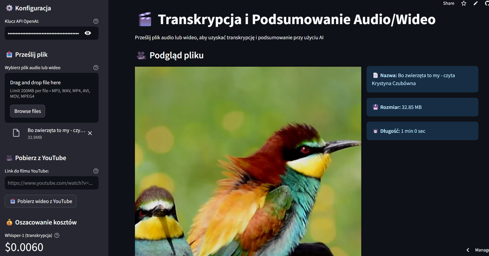
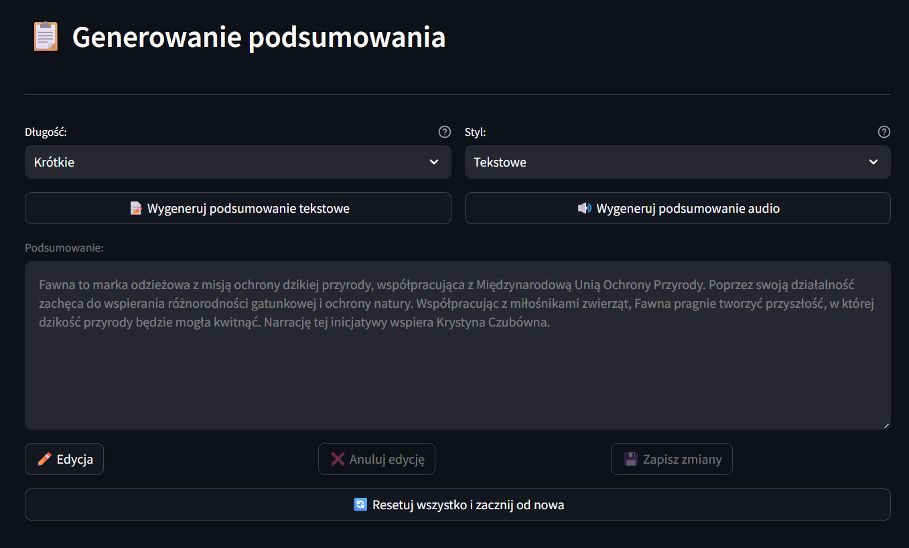
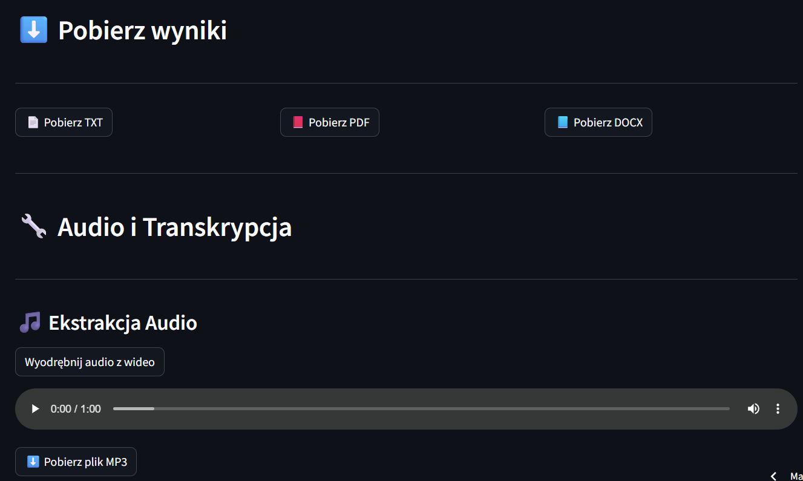
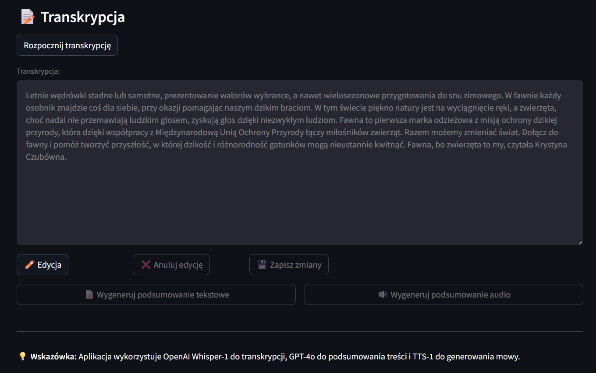

# Podsumowanie Audio/Video

> Automatyczne generowanie podsumowań z treści audio i wideo przy użyciu AI

## � Zobacz Projekt

<div class="grid cards" markdown>
-   [:octicons-mark-github-16: GitHub Repository](https://github.com/twoja-nazwa/podsumowanie-audio-video)
-   [:octicons-play-24: Strona aplikacji](https://demo-link.streamlit.app)
-   [:octicons-book-16: Dokumentacja](https://docs-link.com)
</div>

## �📋 Opis Projektu

Aplikacja wykorzystująca Large Language Models do automatycznego generowania podsumowań z plików audio i wideo. Umożliwia szybkie wydobywanie kluczowych informacji z długich nagrań, oszczędzając czas użytkowników.

## 🎯 Problem

- Długie nagrania audio/wideo są czasochłonne do przesłuchania
- Trudno wydobyć kluczowe punkty z godzinnych prezentacji
- Brak narzędzi do szybkiego przeglądania treści multimedialnych

## ✨ Rozwiązanie

Aplikacja, która:
- 🎤 Transkrybuje audio na tekst
- 🤖 Analizuje treść przy użyciu LLM
- 📝 Generuje zwięzłe podsumowania
- ⏱️ Dodaje timestampy do kluczowych momentów

## 🛠️ Technologie

<div class="grid cards" markdown>
-   **Backend**
    
    
    
    
-   **Frontend**
    
    
    
-   **AI/ML**
    
    - Whisper API (transkrypcja)
    - GPT-4 (podsumowania)
    - LangChain (orchestracja)
</div>

## 📸 Screenshots

!!! example "Interfejs aplikacji - wczytanie pliku"
    
    
!!! example "Przykładowe podsumowanie z opcja edycji"
    
    
!!! example "Sekcja pobierania wyników i ekstracji audio"
    

!!! example "Sekcja transkrypcji i możliwości edycji"
    

## 🚀 Główne Funkcje

### 1. Upload i Przetwarzanie
```python
# Wspierane formaty
supported_formats = ['.mp3', '.mp4', '.wav', '.m4a', '.avi']
```

### 2. Transkrypcja
- Wykorzystanie Whisper API do transkrypcji audio
- Obsługa wielu języków (PL, EN, itp.)
- Wysoka dokładność rozpoznawania mowy

### 3. Generowanie Podsumowań
- Różne poziomy szczegółowości (krótkie/średnie/długie)
- Automatyczne wydobywanie kluczowych punktów
- Dodawanie timestampów do ważnych fragmentów

### 4. Export Wyników
- Eksport do PDF
- Eksport do Markdown
- Kopiowanie do schowka

## 💡 Kluczowe Wyzwania

!!! warning "Długie pliki audio"
    **Problem:** Whisper API ma limit długości pliku  
    **Rozwiązanie:** Automatyczne dzielenie długich nagrań na chunki

!!! warning "Koszty API"
    **Problem:** Wysokie koszty transkrypcji i LLM  
    **Rozwiązanie:** Cache'owanie transkrypcji, optymalizacja promptów

!!! warning "Jakość transkrypcji"
    **Problem:** Słaba jakość audio wpływa na wyniki  
    **Rozwiązanie:** Pre-processing audio (noise reduction)

##  Możliwe Rozszerzenia

- [ ] Wsparcie dla streamingu video (YouTube, Vimeo)
- [ ] Automatyczne generowanie mind maps
- [ ] Integracja z Notion/Obsidian
- [ ] Multi-language support w interfejsie
- [ ] Batch processing wielu plików
- [ ] Sentiment analysis nagrań

## 🎓 Czego się Nauczyłem

- Integracja z API OpenAI (Whisper, GPT)
- Obsługa dużych plików multimedialnych w Python
- Optymalizacja kosztów API przez caching
- Tworzenie intuicyjnego UI w Streamlit
- Prompt engineering dla lepszych podsumowań

## 📝 Wnioski

Projekt pokazuje praktyczne zastosowanie AI do rozwiązywania rzeczywistych problemów. Kluczowe było zbalansowanie jakości wyników z kosztami API oraz utworzenie przyjaznego interfejsu użytkownika.

---

**Status projektu:** ✅ Ukończony  
**Ostatnia aktualizacja:** Styczeń 2026  
**Licencja:** MIT
