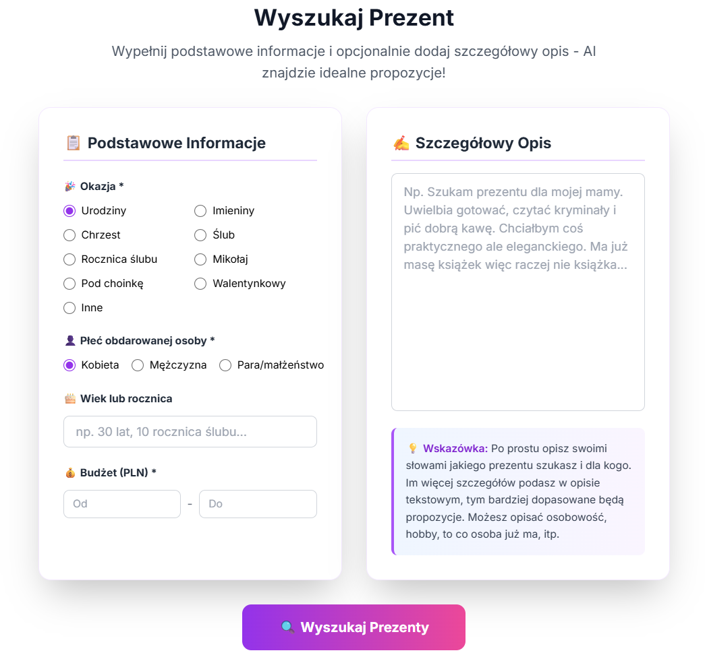
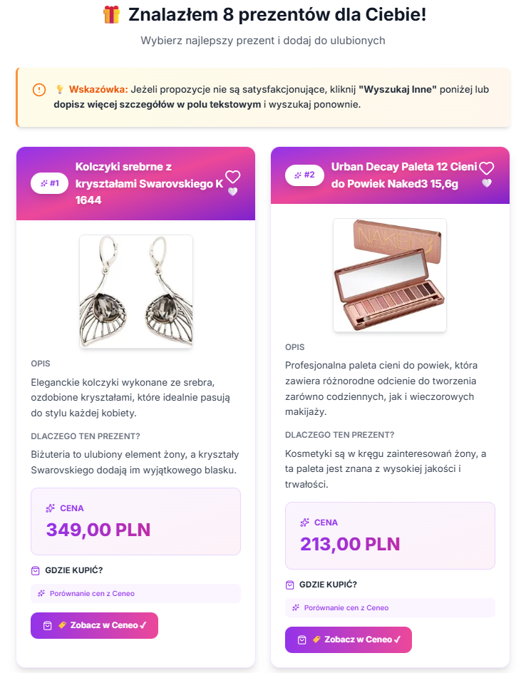
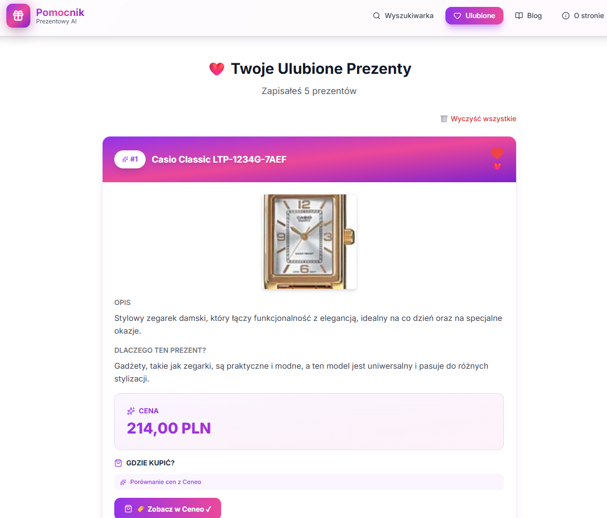
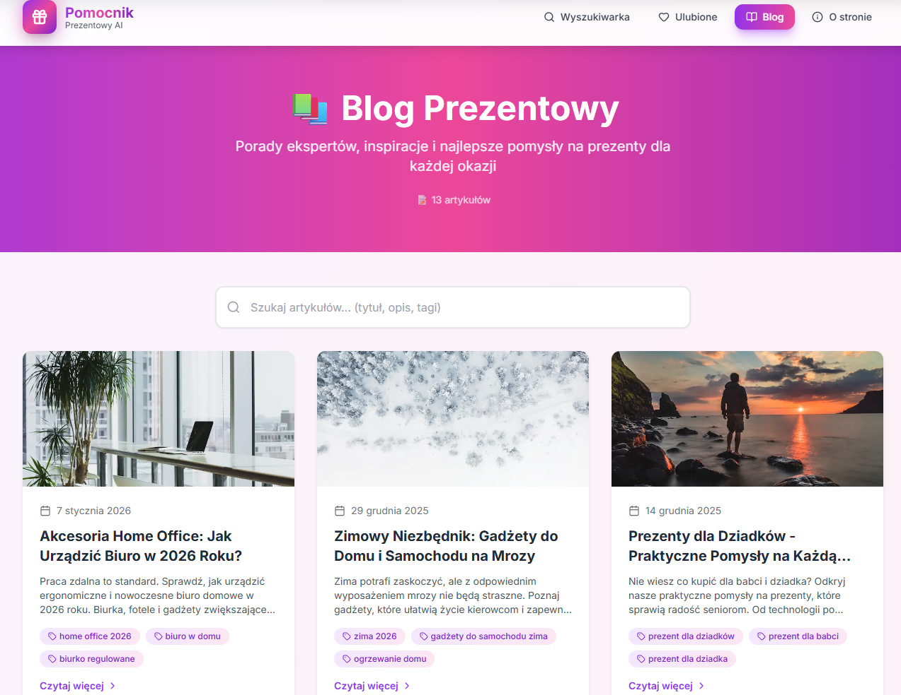
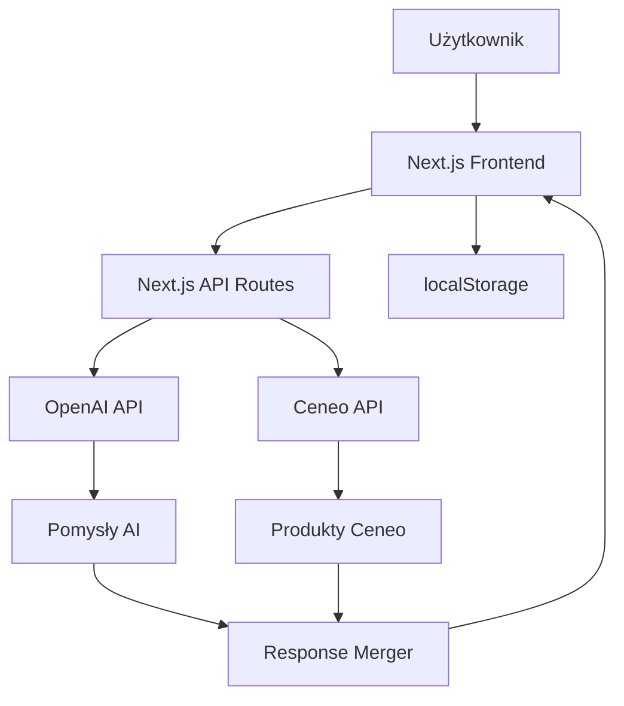

# Pomocnik Prezentowy AI

> Inteligentny asystent w wyborze idealnego prezentu wykorzystujący AI i integrację z platformami e-commerce

## � Zobacz Projekt

<div class="grid cards" markdown>
-   [:octicons-mark-github-16: GitHub Repository](https://github.com/twoja-nazwa/pomocnik-prezentowy)
-   [:octicons-play-24: Strona aplikacji](https://pomocnik-prezentowy.vercel.app)
-   [:octicons-book-16: Dokumentacja API](https://pomocnik-prezentowy.vercel.app/api-docs)
</div>

## �📋 Opis Projektu

**Pomocnik Prezentowy AI** to zaawansowana aplikacja webowa w Next.js 14, która revolutionuje proces wyboru prezentów. Wykorzystując OpenAI GPT-4o-mini i Ceneo API, aplikacja generuje spersonalizowane propozycje prezentów z prawdziwymi ofertami i linkami afiliacyjnymi.

## 🎯 Problem

- Trudność w znalezieniu odpowiedniego prezentu dla bliskich
- Brak inspiracji przy wyborze prezentów
- Czasochłonne przeszukiwanie sklepów online
- Przekroczenie budżetu przy zakupach

## ✨ Rozwiązanie

Aplikacja, która:
- 🎁 Sugeruje dopasowane prezenty na podstawie prostego formularza
- 🤖 Wykorzystuje AI do personalizacji propozycji
- 🛒 Pokazuje rzeczywiste produkty z Ceneo z cenami i linkami
- ❤️ Umożliwia zapisywanie ulubionych prezentów
- 📝 Zawiera blog z poradami dotyczącymi wyboru prezentów

## 🛠️ Technologie

<div class="grid cards" markdown>
-   **Frontend**
    
    
    
    
    
-   **Backend & AI**
    
    - OpenAI API (GPT-4o-mini)
    - Ceneo API (OAuth 2.0)
    - Next.js API Routes
    
-   **Deployment**
    
    
</div>

## 🚀 Główne Funkcje

### 1. Inteligentny Formularz
```typescript
// Dane wejściowe
{
  okazja: "Urodziny" | "Święta" | "Ślub" | ...,
  płeć: "Mężczyzna" | "Kobieta" | "Inne",
  wiek: number,
  budżet: number,
  opcjonalnyOpis?: string
}
```

### 2. Generowanie Propozycji AI
- Analiza preferencji odbiorcy
- Uwzględnienie budżetu i okazji
- Generowanie do 10 różnorodnych propozycji
- Wyszukiwanie rzeczywistych produktów w Ceneo

### 3. System Ulubionych
- Zapisywanie wybranych prezentów w localStorage
- Zarządzanie listą ulubionych
- Brak konieczności logowania
- Persistence między sesjami

### 4. Blog z Poradami
- Artykuły w formacie JSON + Markdown
- Wyszukiwarka artykułów (live filtering)
- Paginacja (12 artykułów na stronę)
- Pełne SEO (Open Graph, Schema.org)

## 💡 Kluczowe Wyzwania

!!! warning "Integracja z Ceneo API"
    **Problem:** Złożona autoryzacja OAuth 2.0 i specyficzne wymagania API  
    **Rozwiązanie:** Implementacja dedykowanego serwisu z tokenami i retry logic

!!! warning "Formatowanie odpowiedzi AI"
    **Problem:** GPT generuje różne formaty odpowiedzi  
    **Rozwiązanie:** Structured prompting z przykładami i walidacja JSON

!!! warning "Koszty API"
    **Problem:** Każde zapytanie generuje koszty OpenAI i Ceneo  
    **Rozwiązanie:** Optymalizacja promptów, cache'owanie wyników

!!! warning "SEO i Performance"
    **Problem:** SSR i optymalizacja dla wyszukiwarek  
    **Rozwiązanie:** Next.js App Router, metadata API, Image optimization

## � Screenshots

!!! example "Interfejs użytkownika"
    

!!! example "Widok formularza"
      

!!! example "Przykład wyników wyszukiwania"
    

!!! example "Sekcja Ulubionych"
    
    
!!! example "Sekcja Ulubionych"
    

## �📊 Architektura



## 🎨 Interfejs Użytkownika

### Główna Strona
- Minimalistyczny formularz z gradientami purple/pink
- Responsywny design (mobile-first)
- Grid 2-kolumnowy dla produktów

### Wyniki Wyszukiwania
- Karty produktów z:
  - Zdjęciem produktu (proxy dla obrazków)
  - Nazwą i opisem
  - Ceną (format PL: 123,45 PLN)
  - Linkiem afiliacyjnym do Ceneo
  - Przyciskiem "Dodaj do ulubionych"

### Ulubione
- Lista zapisanych produktów
- Możliwość usuwania z ulubionych
- Export/import (opcjonalnie)

## 📈 Możliwe Rozszerzenia

- [ ] Integracja z Allegro API
- [ ] System rekomendacji ML (collaborative filtering)
- [ ] Historia wyszukiwań użytkownika
- [ ] Eksport listy ulubionych do PDF
- [ ] Powiadomienia o obniżkach cen
- [ ] Social sharing (udostępnianie list)
- [ ] Multi-language support
- [ ] Porównywarka cen między platformami

## 🎓 Czego się Nauczyłem

- **Next.js 14 App Router** - nowa architektura i Server Components
- **OAuth 2.0** - implementacja flow z Ceneo API
- **Prompt Engineering** - optymalizacja zapytań do GPT dla structured output
- **TypeScript** - type-safe development w dużym projekcie
- **SEO w Next.js** - metadata API, sitemap, robots.txt
- **Affiliate Marketing** - integracja z programami partnerskimi
- **Responsive Design** - mobile-first approach z TailwindCSS

## 📝 Wnioski

Projekt pokazuje praktyczne zastosowanie AI w e-commerce i jak można połączyć różne API (OpenAI, Ceneo) w jeden seamless user experience. Kluczowe było dobrze zaprojektowane UX, które upraszcza proces wyboru prezentu.

**Wyzwania techniczne:**
- Integracja z zewnętrznymi API (autoryzacja, rate limiting)
- Optymalizacja kosztów API calls
- SEO w aplikacji z dynamiczną treścią

**Sukcesy:**
- Intuicyjny interfejs użytkownika
- Szybkie generowanie propozycji (< 5s)
- Rzeczywiste produkty z prawdziwymi ofertami
- Pełna responsywność i SEO

---

**Status projektu:** ✅ Ukończony i wdrożony  
**Ostatnia aktualizacja:** Styczeń 2026  
**Stack:** Next.js 14, TypeScript, TailwindCSS, OpenAI, Ceneo API  
**Licencja:** MIT
