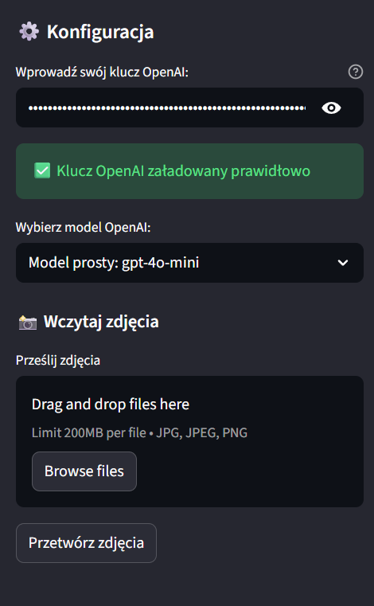
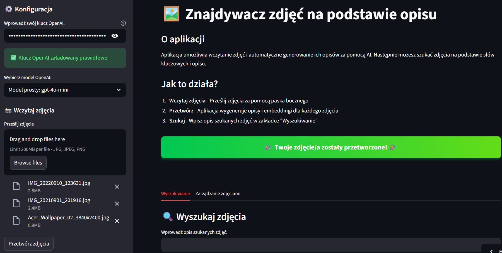
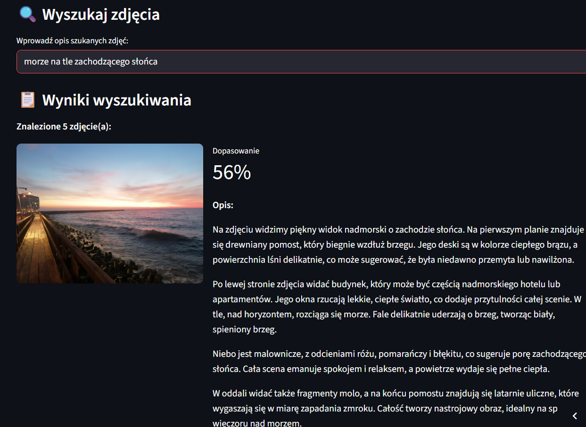
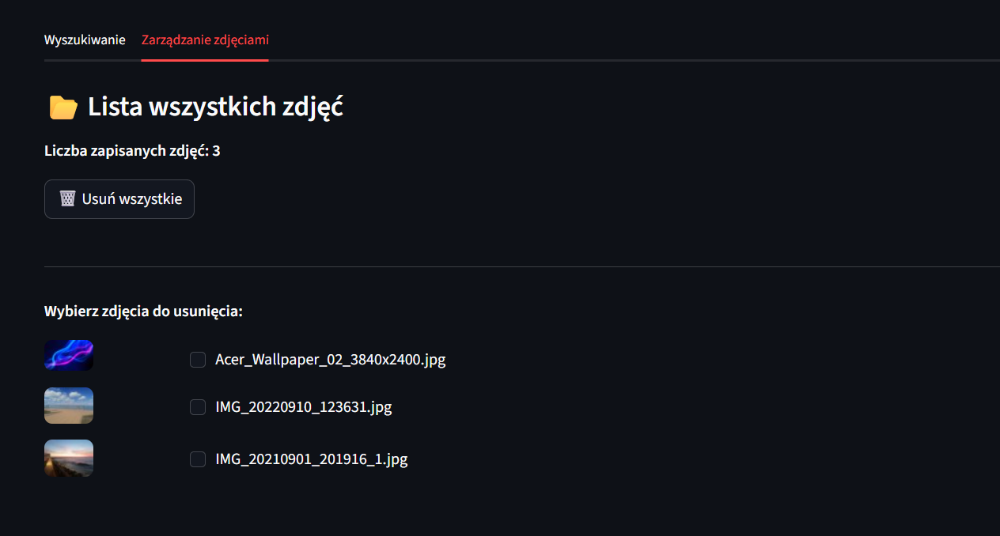
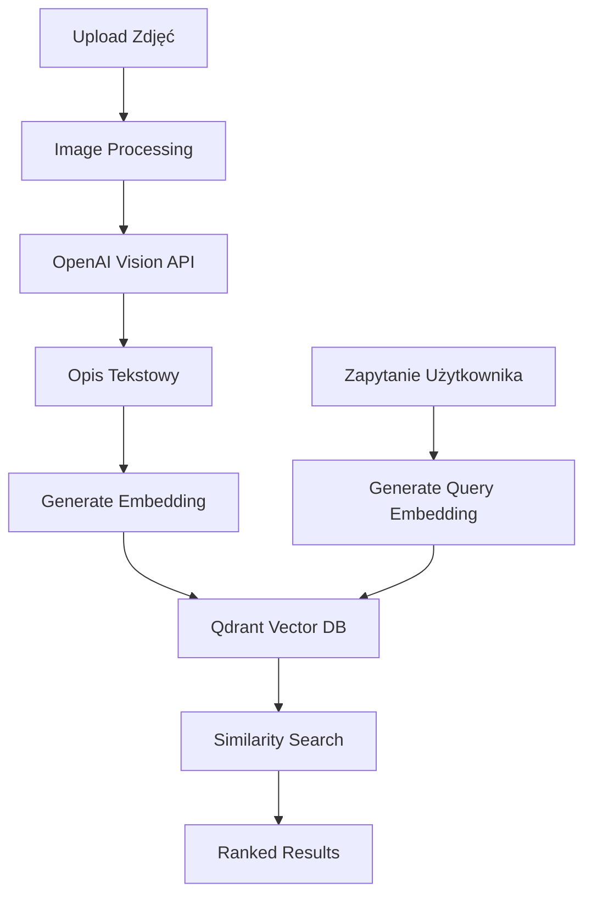

# Znajdywacz Zdjęć

> Inteligentne wyszukiwanie obrazów w naturalnym języku przy użyciu AI Vision i vector embeddings

## � Zobacz Projekt

<div class="grid cards" markdown>
-   [:octicons-mark-github-16: GitHub Repository](https://github.com/twoja-nazwa/znajdywacz-zdjec)
-   [:octicons-play-24: Strona aplikacji](https://znajdywacz-zdjec.streamlit.app)
-   [:octicons-cloud-16: Qdrant Cloud](https://cloud.qdrant.io)
</div>

## �📋 Opis Projektu

Aplikacja do zarządzania i semantycznego wyszukiwania zdjęć, która automatycznie generuje opisy obrazów przy użyciu OpenAI Vision API i umożliwia wyszukiwanie w naturalnym języku. Wykorzystuje vector embeddings i bazę Qdrant do szybkiego i trafnego wyszukiwania.

## 🎯 Problem

- Trudność w organizacji dużych zbiorów zdjęć
- Czasochłonne ręczne tagowanie obrazów
- Niemożność wyszukiwania zdjęć po treści
- Brak narzędzi do semantycznego wyszukiwania w lokalnych kolekcjach

## ✨ Rozwiązanie

Aplikacja, która:
- 🖼️ Automatycznie generuje szczegółowe opisy zdjęć AI
- 🔍 Umożliwia wyszukiwanie w naturalnym języku
- 💾 Przechowuje zdjęcia i embeddings w bazie Qdrant
- 🎯 Rankinguje wyniki według dopasowania (%)
- 🗑️ Pozwala zarządzać kolekcją (usuwanie, duplikaty)

## 🛠️ Technologie

<div class="grid cards" markdown>
-   **Frontend**
    
    
    
-   **AI & Vision**
    
    - OpenAI Vision API (GPT-4o, GPT-4o-mini, GPT-4-turbo)
    - OpenAI Embeddings (text-embedding-3-small)
    
-   **Vector Database**
    
    
    
-   **Image Processing**
    
    - Pillow (PIL)
    - Base64 encoding
</div>

## 🚀 Główne Funkcje

### 1. Przetwarzanie Zdjęć
```python
# Upload wielu zdjęć jednocześnie
supported_formats = ['.jpg', '.jpeg', '.png']

# Automatyczne generowanie opisów
for image in uploaded_images:
    description = generate_description(image, model)
    embedding = create_embedding(description)
    save_to_qdrant(image, description, embedding)
```

### 2. Wybór Modelu AI
- **gpt-4o-mini** - tańszy, szybszy (zalecany)
- **gpt-4o** - balans jakości i ceny
- **gpt-4-turbo** - najlepsza jakość opisów

### 3. Semantyczne Wyszukiwanie
```python
# Przykładowe zapytania
"zdjęcie kota na kanapie"
"zachód słońca nad morzem"
"ludzie jedzący pizzę w restauracji"

# Wyniki z rankingiem
[
  {"image": "cat_on_sofa.jpg", "score": 95.2%, "description": "..."},
  {"image": "cat_sleeping.jpg", "score": 87.5%, "description": "..."},
]
```

### 4. Zarządzanie Kolekcją
- **Lista wszystkich zdjęć** z miniaturkami
- **Zaznaczanie i usuwanie** wybranych zdjęć
- **Wykrywanie duplikatów** podczas uploadu
- **Usuwanie wszystkich** zdjęć jednym kliknięciem
- **Synchronizacja** z bazą Qdrant

## 💡 Kluczowe Wyzwania

!!! warning "Jakość Opisów AI"
    **Problem:** Modele mogą generować różne opisy dla tego samego zdjęcia  
    **Rozwiązanie:** Strukturalne prompty z instrukcjami generowania szczegółowych opisów

!!! warning "Koszty API"
    **Problem:** Vision API jest droższe niż standard GPT  
    **Rozwiązanie:** Wybór modelu, oszacowanie kosztów przed przetworzeniem, cache opisów

!!! warning "Rozmiar Embeddings"
    **Problem:** Duże kolekcje zdjęć = duża baza Qdrant  
    **Rozwiązanie:** Efektywny model embeddings (text-embedding-3-small)

!!! warning "Performance Upload"
    **Problem:** Przetwarzanie wielu zdjęć zajmuje czas  
    **Rozwiązanie:** Progress bar, batch processing, asynchroniczne generowanie

## � Screenshots

!!! example "Panel konfiguracji"
    
    
    *Wybór modelu AI i konfiguracja kluczy API*

!!! example "Upload i przetwarzanie"
    
    
    *Przesyłanie zdjęć i automatyczne generowanie opisów*

!!! example "Wyniki wyszukiwania"
    
    
    *Semantyczne wyszukiwanie z rankingiem dopasowania*

!!! example "Zarządzanie kolekcją"
    
    
    *Lista wszystkich zdjęć z opcjami zarządzania*

## �📊 Architektura



## 🏗️ Struktura Projektu

```
znajdywacz_zdjec_v5/
├── src/
│   ├── main.py                 # Główna aplikacja Streamlit
│   ├── config.py               # Konfiguracja API i modeli
│   ├── api_openai.py           # OpenAI API calls
│   ├── baza_danych.py          # Qdrant operations
│   ├── przetwarzanie_zdjec.py  # Image processing
│   ├── embedding.py            # Embeddings generation
│   └── utils.py                # Helper functions
├── zdjecia_przetworzone/       # Saved images
├── uploaded_images/            # Temporary uploads
├── requirements.txt
├── .env.example
└── README.md
```

## 🎨 Interfejs Użytkownika

### Panel Konfiguracji
- Wprowadzanie klucza OpenAI API
- Wybór modelu Vision
- Oszacowanie kosztów

### Przetwarzanie
- Upload wielu zdjęć
- Progress bar z animacją
- Wykrywanie duplikatów
- Komunikaty o sukcesie

### Wyszukiwanie
- Pole tekstowe z przykładami
- Wyniki z miniaturkami
- Procent dopasowania dla każdego wyniku
- Pełne opisy AI

### Zarządzanie
- Lista wszystkich zdjęć
- Checkboxy do zaznaczania
- Przyciski usuwania

##  Oszacowanie Kosztów

| Model | Input (1000 tokens) | Output (1000 tokens) | 100 zdjęć |
|-------|---------------------|----------------------|-----------|
| gpt-4o-mini | $0.150 | $0.600 | ~$5-8 |
| gpt-4o | $2.50 | $10.00 | ~$50-80 |
| gpt-4-turbo | $10.00 | $30.00 | ~$200-300 |

*Embeddings: ~$0.10 za 1M tokenów (bardzo tanie)*

##  Możliwe Rozszerzenia

- [ ] Grupowanie podobnych zdjęć (clustering)
- [ ] Automatyczne tagowanie kategorii
- [ ] Face recognition dla osób
- [ ] OCR dla zdjęć z tekstem
- [ ] Timeline view (sortowanie chronologiczne)
- [ ] Album generator (automatyczne tworzenie albumów)
- [ ] Export do popularnych formatów (JSON, CSV)
- [ ] Integracja z Google Photos / Dropbox

## 🎓 Czego się Nauczyłem

- **OpenAI Vision API** - generowanie opisów z obrazów
- **Vector Embeddings** - reprezentacja tekstu jako wektorów
- **Qdrant** - vector database i similarity search
- **Semantic Search** - wyszukiwanie semantyczne vs keyword
- **Streamlit** - tworzenie interaktywnych aplikacji ML
- **Image Processing** - Pillow, base64 encoding, miniatury
- **Cost Optimization** - optymalizacja kosztów API w aplikacjach AI

## 📝 Wnioski

Projekt pokazuje potęgę połączenia Vision AI z vector search. Możliwość wyszukiwania zdjęć w naturalnym języku rewolucjonizuje sposób organizacji kolekcji obrazów.

**Kluczowe insights:**
- Vision API generuje wysokiej jakości opisy
- Vector embeddings umożliwiają semantyczne wyszukiwanie
- Qdrant zapewnia szybkie similarity search
- Balance między jakością a kosztami jest kluczowy

**Praktyczne zastosowania:**
- Organizacja prywatnych kolekcji zdjęć
- System DAM (Digital Asset Management) dla firm
- E-commerce (wyszukiwanie produktów po opisie)
- Archiwizacja zdjęć historycznych

---

**Status projektu:** ✅ Ukończony  
**Ostatnia aktualizacja:** Styczeń 2026  
**Stack:** Streamlit, OpenAI Vision, Qdrant, Python  
**Licencja:** MIT
