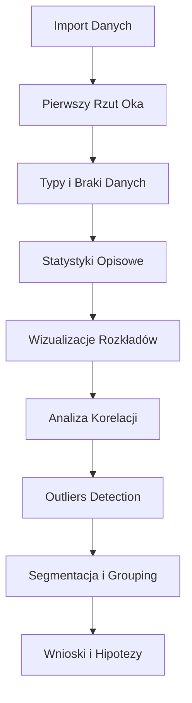

# Data Science

Projekty analityczne skupiające się na eksploracyjnej analizie danych (EDA), wizualizacji i odkrywaniu insightów w danych.

<h2 class="projects-header">Przegląd Projektów</h2>

<div class="grid cards" markdown>

-   :material-flower:{ .lg .middle } __Analiza EDA - Irisy__

    ---

    Klasyczna analiza zbioru danych Iris - podstawy EDA i wizualizacji.

    [:octicons-arrow-right-24: Zobacz projekt](irisy-eda.md)

-   :material-ship-wheel:{ .lg .middle } __Analiza EDA - Titanic__

    ---

    Eksploracyjna analiza danych pasażerów Titanica.

    [:octicons-arrow-right-24: Zobacz projekt](titanic-eda.md)

</div>

## Czym jest EDA?

**Exploratory Data Analysis (EDA)** to proces wstępnej analizy danych mający na celu:

- 🔍 **Poznanie struktury danych** - typy zmiennych, rozmiar dataset
- 📊 **Zrozumienie rozkładów** - statystyki opisowe, histogramy
- 🔗 **Znajdowanie relacji** - korelacje między zmiennymi
- ❓ **Identyfikacja problemów** - braki danych, outliers, duplikaty
- 💡 **Generowanie hipotez** - wstępne insights do modelowania

## Proces EDA



## Narzędzia i Technologie

### Podstawowe Biblioteki
- **Pandas** - manipulacja i analiza danych
- **NumPy** - operacje numeryczne
- **Jupyter Notebooks** - interaktywna analiza

### Wizualizacje
- **Matplotlib** - podstawowe wykresy
- **Seaborn** - zaawansowane wizualizacje statystyczne
- **Plotly** - interaktywne wykresy
- **Missingno** - wizualizacja braków danych

### Analiza Statystyczna
- **SciPy** - testy statystyczne
- **Statsmodels** - modelowanie statystyczne

## Rodzaje Analiz

### 1️⃣ Analiza Jednowymiarowa (Univariate)

Analiza pojedynczych zmiennych:

- Statystyki opisowe (mean, median, std, min, max)
- Rozkłady (histogramy, density plots)
- Outliers (box plots)
- Częstości dla zmiennych kategorycznych

### 2️⃣ Analiza Dwuwymiarowa (Bivariate)

Relacje między dwiema zmiennymi:

- Scatter plots dla zmiennych numerycznych
- Box plots dla kategorycznych vs numeryczne
- Bar plots dla dwóch kategorycznych
- Korelacje (Pearson, Spearman)

### 3️⃣ Analiza Wielowymiarowa (Multivariate)

Relacje między wieloma zmiennymi:

- Correlation matrices (heatmapy)
- Pair plots
- Parallel coordinates
- Dimensionality reduction (PCA, t-SNE)

## Typowe Problemy w Danych

!!! warning "Braki Danych (Missing Values)"
    - Identyfikacja braków
    - Analiza wzorców braków (MCAR, MAR, MNAR)
    - Strategie uzupełniania (imputation)

!!! warning "Outliers"
    - Detekcja outliers (IQR, Z-score)
    - Analiza czy to błędy czy prawdziwe wartości
    - Decyzja o usunięciu lub transformacji

!!! warning "Duplikaty"
    - Identyfikacja duplikatów
    - Analiza przyczyn duplikatów
    - Usuwanie lub merge duplikatów

!!! warning "Niezbalansowane Klasy"
    - Analiza dystrybucji klas
    - Wpływ na modelowanie
    - Strategie balansowania

## Kluczowe Wizualizacje EDA

### Dla Zmiennych Numerycznych
```python
# Histogram - rozkład
sns.histplot(data=df, x='age')

# Box plot - outliers
sns.boxplot(data=df, y='salary')

# Density plot - rozkład gładki
sns.kdeplot(data=df, x='score')
```

### Dla Zmiennych Kategorycznych
```python
# Count plot - częstości
sns.countplot(data=df, x='category')

# Pie chart - proporcje
df['status'].value_counts().plot(kind='pie')
```

### Dla Relacji
```python
# Scatter plot - relacja 2 zmiennych
sns.scatterplot(data=df, x='age', y='income')

# Correlation heatmap
sns.heatmap(df.corr(), annot=True)

# Pair plot - wszystkie relacje
sns.pairplot(df)
```

## Etapy Typowego EDA

### 1. Załadowanie i Pierwszy Rzut
```python
import pandas as pd

df = pd.read_csv('data.csv')
print(df.shape)
print(df.head())
print(df.info())
```

### 2. Statystyki Opisowe
```python
print(df.describe())
print(df.describe(include='object'))
```

### 3. Braki Danych
```python
print(df.isnull().sum())
import missingno as msno
msno.matrix(df)
```

### 4. Wizualizacje
```python
import seaborn as sns
import matplotlib.pyplot as plt

# Numeric distributions
df.hist(figsize=(15, 10))

# Correlations
sns.heatmap(df.corr(), annot=True)
```

### 5. Wnioski
Dokumentowanie insights i hipotez do dalszej pracy.

## Best Practices

✅ Zawsze zacznij od `df.info()` i `df.describe()`  
✅ Wizualizuj wszystkie zmienne - wzrok wyłapie wzorce  
✅ Szukaj outliers i braków danych  
✅ Analizuj korelacje między zmiennymi  
✅ Dokumentuj wszystkie obserwacje  
✅ Generuj hipotezy do testowania  
✅ Nie wyciągaj pochopnych wniosków - weryfikuj statystycznie  

---

EDA to fundament każdego projektu Data Science. Dobrze przeprowadzona eksploracja danych to klucz do sukcesu w modelowaniu!
