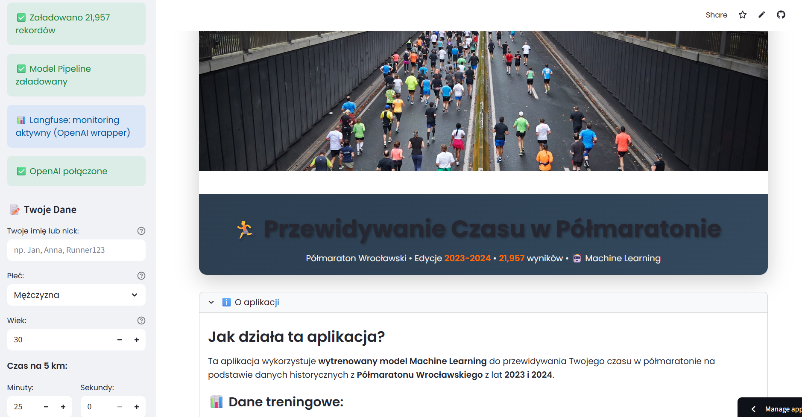
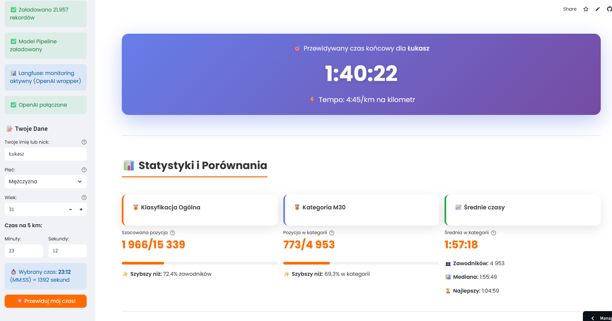
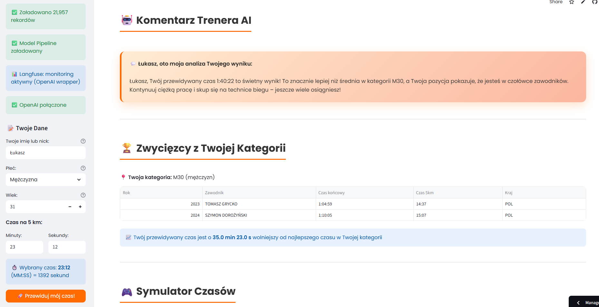

# Half Marathon Results Prediction

> Prognozowanie czasów w półmaratonie na podstawie danych treningowych i wyścigowych

## 📋 Opis Projektu

Projekt predykcji czasów ukończenia półmaratonu (21.1 km) na podstawie historycznych danych treningowych zawodników, wyników wcześniejszych biegów i czynników fizjologicznych.

## 🎯 Cel

Stworzenie modelu ML, który przewiduje czas ukończenia półmaratonu dla biegacza na podstawie:
- Danych treningowych (dystans, tempo, częstość)
- Wyników wcześniejszych biegów (5K, 10K)
- Charakterystyk fizycznych (wiek, BMI, doświadczenie)
- Warunków wyścigu (pogoda, profil trasy)

## � Zobacz projekt

-   [:octicons-play-24: Strona aplikacji](https://halfmarathon-results-prediction.streamlit.app/){ .md-button .md-button--primary target="_blank" }

-   [:octicons-book-16: Zobacz Notebook](../notebooks/halfmarathon_model_pipeline.html){ .md-button .md-button--primary target="_blank" }
    
    Pełna analiza EDA, feature engineering, modelowanie i ewaluacja w interaktywnym notebooku.

-   [:octicons-mark-github-16: GitHub Repository](https://github.com/Lukasz6855/halfmarathon-results-prediction){ .md-button .md-button--primary target="_blank" }

## �📊 Dataset

Dane zbierane z:
- Wyniki oficjalnych półmaratonów
- Dane treningowe z aplikacji sportowych
- Charakterystyki zawodników
- Warunki pogodowe podczas wyścigów

**Features:**
- Best 5K time
- Best 10K time
- Average weekly mileage
- Age, Gender, BMI
- Training pace
- Years of running experience
- Race elevation gain

## 🛠️ Technologie

- Python, Scikit-learn
- Pandas, NumPy
- Feature Engineering
- Time Series Analysis (opcjonalnie)
- Streamlit (UI aplikacji)

## 📈 Model & Performance

**Target:** Czas półmaratonu (w minutach)

**Algorytmy testowane:**
- Linear Regression (baseline)
- Random Forest Regressor
- Gradient Boosting Regressor
- XGBoost (likely winner)

**Metryki:**
- MAE (Mean Absolute Error)
- RMSE
- R² score
- MAPE (Mean Absolute Percentage Error)

## 💡 Feature Engineering

Utworzone cechy:
- **5K to 10K ratio** - consistency indicator
- **Training volume** - weekly km
- **Age group categories**
- **Pace zones** - easy/moderate/hard
- **Recent form** - ostatnie 4 tygodnie
- **Race experience** - liczba ukończonych biegów

## 🎓 Insights

- 10K time jest najlepszym predyktorem
- Training volume ma mniejsze znaczenie niż quality training
- Age effect: nonlinear (best around 30-35)
- Recent injuries/breaks significantly impact performance

## 📸 Screenshots

!!! example "Aplikacja Streamlit"
    
    
    *Interfejs aplikacji do predykcji czasów*

!!! example "Wyniki analizy"
    
    
    *Predykcja czasu i rekomendacje treningowe*

!!! example "Wizualizacje"
    
    
    *Wykresy i analiza czynników wpływających na wynik*

## 🚀 Aplikacja

Streamlit app umożliwia:
- Input danych biegacza
- Predykcja czasu półmaratonu
- Rekomendacje treningowe
- Porównanie z innymi biegaczami

---

**Status:** ✅ Ukończony  
**Tech Stack:** Python, Scikit-learn, Streamlit  
**Model:** Gradient Boosting / XGBoost
