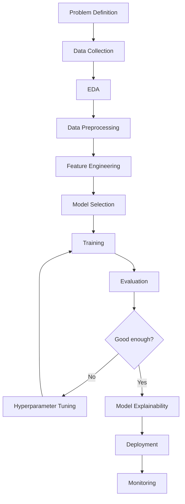

# Machine Learning

Projekty predykcyjne wykorzystujące różne techniki Machine Learning: klasyfikacja, regresja, clustering oraz pełne pipeline'y od eksploracji danych po deployment modeli.

<h2 class="projects-header">Przegląd Projektów</h2>

### 📈 Regresja

-   __Half Marathon Prediction__

    ---

    Prognozowanie czasów w półmaratonie na podstawie danych treningowych.

    [:octicons-arrow-right-24: Zobacz projekt](halfmarathon-prediction.md)

-   __House Price Regression__

    ---

    Predykcja cen nieruchomości na podstawie ich charakterystyk.

    [:octicons-arrow-right-24: Zobacz projekt](house-price-regression.md)

-   __Prognoza Cen Ubezpieczeń__

    ---

    Model regresji przewidujący koszty ubezpieczeń zdrowotnych.

    [:octicons-arrow-right-24: Zobacz projekt](prognoza-ubezpieczen.md)

### 🎨 Clustering

-   __Customer Segmentation__

    ---

    Segmentacja klientów przy użyciu algorytmów clusteringu.

    [:octicons-arrow-right-24: Zobacz projekt](customer-segmentation.md)

### 🎯 Klasyfikacja

-   __Titanic Classification__

    ---

    Klasyczny problem przewidywania przeżycia pasażerów Titanica.

    [:octicons-arrow-right-24: Zobacz projekt](titanic-classification.md)

### 🚀 Churn Prediction - Kompletny Pipeline

Seria projektów pokazująca pełny proces od analizy do wdrożenia:

-   __1. Overfitting Analysis__

    ---

    Analiza i zapobieganie overfittingowi w modelach.

    [:octicons-arrow-right-24: Zobacz](churn-overfitting.md)

-   __2. Model Tuning__

    ---

    Optymalizacja hiperparametrów modelu.

    [:octicons-arrow-right-24: Zobacz](churn-model-tuning.md)

-   __3. Recall & Threshold__

    ---

    Optymalizacja threshold dla lepszego recall.

    [:octicons-arrow-right-24: Zobacz](churn-recall-threshold.md)

-   __4. Model Deployment__

    ---

    Wdrożenie modelu do produkcji.

    [:octicons-arrow-right-24: Zobacz](churn-model-deployment.md)

-   __5. Model Explainability__

    ---

    Interpretowalność modelu i SHAP values.

    [:octicons-arrow-right-24: Zobacz](churn-explainability.md)

## Technologie i Narzędzia

### Biblioteki ML
- **Scikit-learn** - główna biblioteka ML
- **XGBoost** - gradient boosting
- **LightGBM** - szybki gradient boosting
- **CatBoost** - boosting dla danych kategorycznych

### Preprocessing & Feature Engineering
- **Pandas** - manipulacja danymi
- **NumPy** - operacje numeryczne
- **Category Encoders** - kodowanie zmiennych kategorycznych
- **Feature Engine** - feature engineering

### Model Evaluation
- **Metrics** - accuracy, precision, recall, F1, ROC-AUC
- **Cross-validation** - walidacja krzyżowa
- **Confusion Matrix** - macierz pomyłek

### Interpretability
- **SHAP** - Shapley Additive Explanations
- **LIME** - Local Interpretable Model-agnostic Explanations
- **Feature Importance** - ważność cech

### Deployment
- **Pickle/Joblib** - serializacja modeli
- **Flask/FastAPI** - API dla modeli
- **Docker** - konteneryzacja
- **MLflow** - tracking eksperymentów

## Proces ML Pipeline

## Rodzaje Problemów ML

!!! info "Klasyfikacja"
    Przewidywanie kategorii (binarna lub wieloklasowa). Przykłady: spam/not spam, diagnoza chorób, ocena ryzyka kredytowego.

!!! info "Regresja"
    Przewidywanie wartości ciągłych. Przykłady: ceny nieruchomości, temperatura, przychody.

!!! info "Clustering"
    Grupowanie podobnych obiektów bez etykiet. Przykłady: segmentacja klientów, wykrywanie anomalii.

!!! info "Time Series"
    Prognozowanie szeregów czasowych. Przykłady: sprzedaż, ceny akcji, popyt.

## Metryki Ewaluacji

### Klasyfikacja
- **Accuracy** - ogólna dokładność
- **Precision** - precyzja (ile z pozytywnych to prawdziwie pozytywne)
- **Recall** - czułość (ile prawdziwych pozytywnych złapaliśmy)
- **F1-Score** - średnia harmoniczna precision i recall
- **ROC-AUC** - pole pod krzywą ROC

### Regresja
- **MAE** - Mean Absolute Error
- **MSE** - Mean Squared Error
- **RMSE** - Root Mean Squared Error
- **R²** - współczynnik determinacji
- **MAPE** - Mean Absolute Percentage Error
---

Każdy projekt w tym portfolio pokazuje różne aspekty pracy z Machine Learning - od podstawowych algorytmów, przez trenning modelu, tuning aż po deployment.
