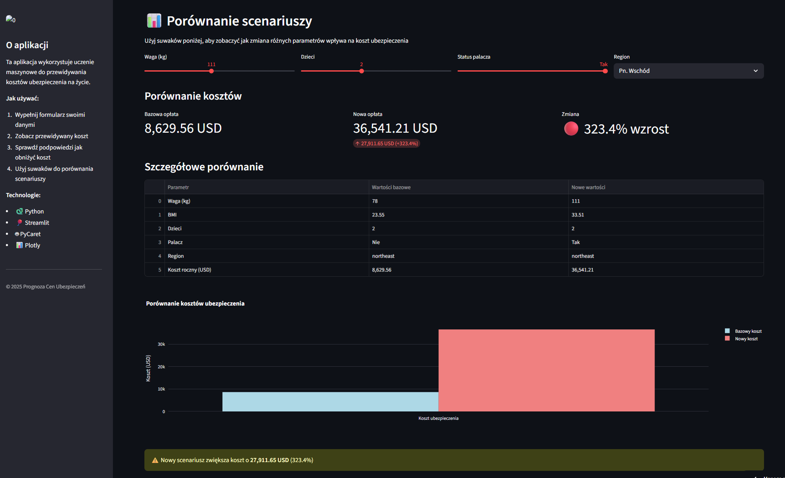

# Prognoza Cen Ubezpieczeń

> Przewidywanie kosztów ubezpieczeń zdrowotnych przy użyciu regresji

## 📋 Opis Projektu

Model regresji przewidujący roczne koszty ubezpieczenia zdrowotnego na podstawie charakterystyk ubezpieczonego: wiek, BMI, liczba dzieci, palenie, region.

## 🎯 Cel

Stworzenie modelu, który pomoże:
- Firmom ubezpieczeniowym w pricing
- Klientom w oszacowaniu przyszłych kosztów
- Identyfikacji czynników ryzyka

## � Zobacz projekt

-   [:octicons-play-24: Strona aplikacji](https://podsumowanie-audio-video.streamlit.app/)

-   [:octicons-book-16: Zobacz Notebook](../notebooks/trenowanie_modelu.html){ .md-button .md-button--primary target="_blank" }
    
    Pełna analiza: preprocessing, modelowanie, tuning i ewaluacja wyników.

-   [:octicons-mark-github-16: GitHub Repository](https://github.com/Lukasz6855/prognoza-cen-ubezpieczen)

## �📊 Dataset

**Medical Cost Personal Dataset**

Features:
- **Age** - wiek ubezpieczonego
- **Sex** - płeć
- **BMI** - wskaźnik masy ciała
- **Children** - liczba dzieci
- **Smoker** - czy pali (yes/no)
- **Region** - region zamieszkania (northeast, northwest, southeast, southwest)

**Target:** Charges (roczny koszt ubezpieczenia w USD)

## 🛠️ Technologie

- Python, Scikit-learn
- Pandas, NumPy
- Matplotlib, Seaborn
- Feature Engineering
- Regularization techniques

## 📈 Wyniki

**Model:** Gradient Boosting / Random Forest

**Performance:**
- MAE: ~$2,500
- RMSE: ~$4,000
- R²: 0.85-0.90

**Feature Importance:**
1. **Smoker** 🚬 - zdecydowanie największy wpływ
2. **Age** - rośnie z wiekiem
3. **BMI** - wyższe BMI = wyższe koszty
4. **Children** - więcej dzieci = wyższe koszty
5. **Region** - różnice regionalne

## 💡 Key Insights

!!! warning "Smoking Effect"
    Palacze płacą średnio **3-4x więcej** niż niepalący!
    - Non-smoker avg: $8,500/rok
    - Smoker avg: $32,000/rok

!!! info "Age Factor"
    Koszt rośnie **nieliniowo** z wiekiem:
    - 18-25: ~$3,000
    - 40-50: ~$10,000
    - 60+: ~$20,000+

!!! tip "BMI Impact"
    Overweight (BMI > 30) zwiększa koszty o ~30%

## 🎨 Visualizations

- Scatter plots: Age vs Charges (colored by Smoker)
- Box plots: Smoker vs Non-smoker costs
- Heatmap: Feature correlations
- Distribution plots: Charges distribution

## 📸 Screenshots

!!! example "Analiza danych"
    
    
    *Eksploracyjna analiza danych - rozkłady i korelacje*

!!! example "Feature Importance"
    
    
    *Wpływ poszczególnych cech na koszt ubezpieczenia*

!!! example "Predykcje modelu"
    
    
    *Porównanie rzeczywistych i przewidywanych kosztów*

## 🚀 Business Value

**Dla firm ubezpieczeniowych:**
- Lepszy pricing
- Risk assessment
- Targeted wellness programs

**Dla klientów:**
- Oszacowanie kosztów
- Motywacja do zmiany stylu życia
- Porównanie ofert

---

**Status:** ✅ Ukończony  
**Tech:** Python, Scikit-learn  
**R²:** 0.85-0.90
